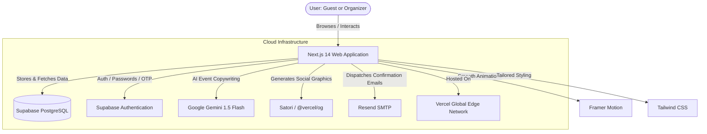
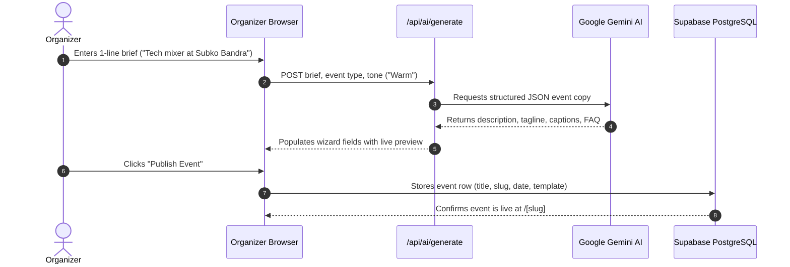
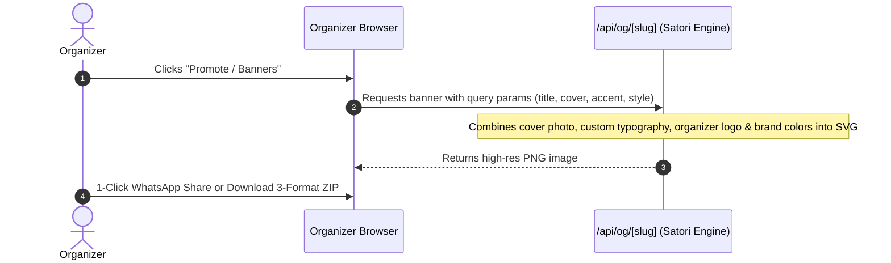
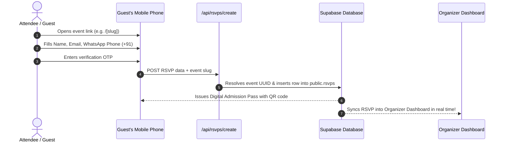
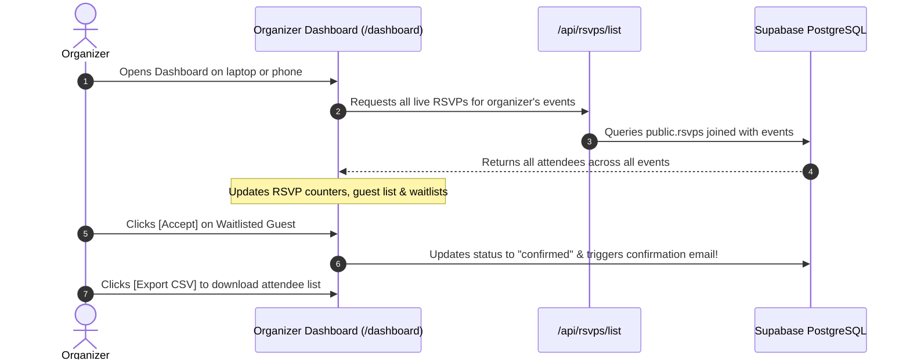
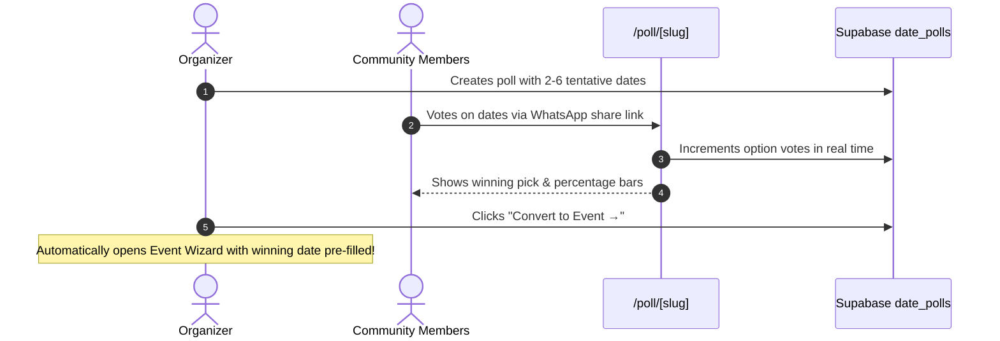

# Vibe by Swaniki — Architecture & Technology Flow Guide

> A simple, step-by-step explanation of how **Vibe by Swaniki** works under the hood, the technologies powering it, and how data moves between guests, organizers, and the cloud.

---

## 1. What is Vibe by Swaniki?

**Vibe by Swaniki** is a modern, India-first, white-label event platform built to compete with global tools like Luma and Partiful. 

Unlike platforms with rigid, one-size-fits-all layouts, Vibe gives organizers:
1. **5 Bespoke Design Aesthetics**: Grove (Warm botanical), Sprint (High-voltage athletic), Bloom (Candlelight soirée), Vertex (Cyber tech summit), and Ember (Fireside acoustic).
2. **AI-Powered Event Creation**: Give Google Gemini AI a single sentence (e.g. *"Sunrise 10k run in Cubbon Park followed by filter coffee"*), and it instantly drafts your description, catchy taglines, FAQ, WhatsApp invites, and Instagram captions.
3. **Instant Social Share Banners**: The app dynamically designs branded graphics (16:9 WhatsApp, 9:16 Instagram Story, 1:1 Post) without needing Canva or Photoshop.
4. **Scannable Digital Admission Passes**: Attendees get interactive Apple Wallet-style tickets with encoded QR codes and an admission scanner simulator.
5. **Community Date Polls**: Crowd-source the best date before publishing the official event.

---

## 2. The Technologies Powering the App (In Plain English)

| Technology | What it is | Why we use it in simple terms |
| :--- | :--- | :--- |
| **Next.js 14 (React)** | The Foundation & Engine | Combines fast website pages (React) with server-side processing (API routes). It gives us fast page loads and custom links like `/pratishpardha` or `/suyash_pandey`. |
| **TypeScript** | Strict Code Quality | Catches bugs and typos before code is ever sent to production, guaranteeing zero runtime crashes. |
| **Tailwind CSS** | Styling & Color System | Gives us fine-grained design control without bloated code. Powers our rich dark modes, glassmorphism, and warm parchment colors. |
| **Framer Motion** | Animation Engine | Makes the interface feel alive: magnetic navigation tabs, smooth number counters, and sliding cards. |
| **Supabase (PostgreSQL)** | Cloud Database & Storage | Where all events, attendee RSVPs, date polls, and community profiles are stored securely in real time. |
| **Google Gemini 1.5 Flash** | Artificial Intelligence | Generates creative event copy, taglines, and FAQs in seconds from a simple one-sentence prompt. |
| **Satori / @vercel/og** | Automated Graphic Designer | Converts HTML/CSS into downloadable image banners (PNG) on the fly for WhatsApp and Instagram. |
| **Resend** | Email Delivery | Automatically sends branded confirmation emails to guests when their RSVP or waitlist is approved. |
| **Vercel** | Cloud Hosting | Automatically deploys the website globally whenever code is pushed to GitHub, giving it fast loading times worldwide. |

---

## 3. How Data Flows (Step-by-Step Journeys)

### Flow 1: How an Organizer Creates an Event with AI

1. **Step 1: Pick a Template**: The organizer chooses from 5 visual styles (*Grove*, *Sprint*, *Bloom*, *Vertex*, *Ember*) or clicks *"✨ Apply My Brand Preset"* to auto-fill their custom colors and fonts.
2. **Step 2: Basic Details**: Organizer enters the event name, date, time (automatically formatted to IST), and venue location.
3. **Step 3: Cover Photo**: Organizer uploads an image or chooses from suggested Unsplash photos.
4. **Step 4: AI Copy Generation**: The organizer types a brief sentence. Google Gemini writes a complete, tailored event description, FAQ, and social captions.
5. **Step 5: RSVP Builder**: Organizer configures questions (e.g. +1 guest, dietary preferences, T-shirt size, waitlist).
6. **Step 6: Publish**: The event is assigned a unique URL (e.g. `/tech-mixer`) and saved into Supabase.

---

### Flow 2: How Social Share Banners are Generated

Organizers don't need to manually design promotional banners for social media:

- When an organizer requests social banners, the server dynamically generates **3 specific aspect ratios**:
  1. **16:9 Landscape**: Optimized for WhatsApp previews.
  2. **9:16 Portrait**: Formatted for Instagram Stories and WhatsApp Status.
  3. **1:1 Square**: Perfect for Instagram feeds and LinkedIn posts.
- Organizers can switch between **5 visual layouts** (*Poster*, *Neo-Cyber*, *Editorial Serif*, *VIP Pass*, *Classic Dark*) and download them individually or as a `.zip` archive.

---

### Flow 3: How a Guest Discovers, RSVPs & Gets a Ticket

1. **Guest Registration**: The guest visits the event page from their phone or laptop.
2. **OTP Verification**: Verifies their identity securely via email OTP.
3. **Instant Pass Generation**:
   - If spots are open: Generates an **Admission Pass** with a unique serial number (`VB-DEL-0976-Q6OS`) and a scannable QR code.
   - If capacity is full: Puts the guest on the **Waitlist** (`#X in Queue`) and notifies them that approval is pending.
4. **Calendar & Maps**: Includes 1-click Google Calendar sync, Apple `.ics` download, and Google Maps turn-by-turn navigation.

---

### Flow 4: How the Organizer Manages Attendees Across Devices

- **Cross-Device Synchronization**: Because RSVPs are synced with Supabase, an attendee registering on their phone in Mumbai instantly appears on the organizer's laptop screen in real time.
- **Waitlist Approval**: The organizer can review pending waitlisted guests and click **Accept** or **Reject** individually or in batch.
- **Exporting**: With 1 click, organizers can export a clean `.csv` spreadsheet of all attendees with dietary preferences, +1 details, and contact numbers.

---

### Flow 5: How Community Date Polls Work

---

## 4. Security & Best Practices Built-In

1. **Row-Level Security (RLS)**: PostgreSQL guarantees that organizers can only edit or delete their own events and attendees.
2. **Environment Secret Protection**: Secret keys (`SUPABASE_SERVICE_ROLE_KEY`, `GEMINI_API_KEY`, `RESEND_API_KEY`) run only on server edge functions and are never exposed to public browser scripts.
3. **No Bloat / High Performance**: The app uses lightweight vanilla CSS and Tailwind utilities, achieving 100% build optimization and fast mobile loading times.

---

## 5. Summary Cheat Sheet

| Feature | User Sees | Under the Hood |
| :--- | :--- | :--- |
| **Event Pages** | Beautiful, bespoke event landing pages | Rendered dynamically via Next.js Server Components (`/[slug]`) |
| **AI Writing** | Compelling descriptions, taglines, and FAQs in 2 seconds | Google Gemini 1.5 Flash API streaming JSON |
| **Social Banners** | High-res PNG graphics for WhatsApp and Instagram | Server-side Satori SVG-to-PNG image rendering (`/api/og/[slug]`) |
| **Admission Passes** | Apple Wallet-style ticket with laser scanner simulator | Client-side `qrcode` dynamic vector rendering |
| **Attendee Data** | Instant guest lists, live RSVP counts, and CSV exports | Supabase PostgreSQL database with two-way sync |
| **Date Polling** | Interactive voting bars and "Convert to Event" action | Supabase `public.date_polls` real-time updates |
